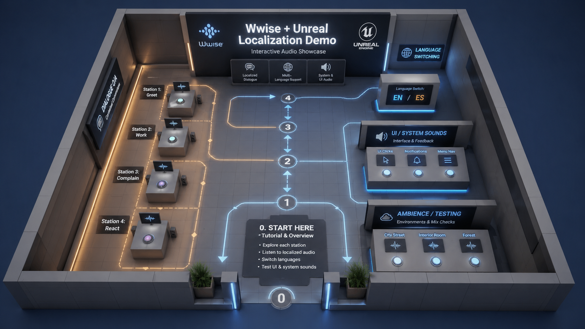

# Localization Audio Pipeline Demo



## EN/ES Game Dialogue Pipeline — Python · Excel · Wwise · Unreal Engine

This project is a technical audio and localization demo showing how game dialogue assets can be organized, processed, automated, implemented, and tested across English and Spanish.

The goal was to build a clean end-to-end workflow that reflects real production needs: structured metadata, consistent file naming, scalable folder organization, Wwise localization, and in-engine playback validation.

---

## Project Highlights

- Built a complete EN/ES voice-over pipeline for a Life Simulation-style game demo.
- Organized dialogue metadata using an Excel-based tracking database.
- Created Python scripts to generate file names, copy cleaned assets, and prepare Wwise-ready folders.
- Prepared localized VO assets for Audiokinetic Wwise.
- Implemented and tested Wwise playback inside Unreal Engine.
- Added runtime language switching between English and Spanish.
- Designed the project as a portfolio-ready technical audio pipeline demo.

---

## Pipeline Overview

```text
Dialogue Dataset
      ↓
Excel Tracking Database
      ↓
Voice Recording / Editing
      ↓
RX Cleanup
      ↓
Python Automation
      ↓
Wwise Localization Setup
      ↓
Unreal Engine Playback Test
```

---

## Tools Used

| Area | Tools |
|---|---|
| Dialogue tracking | Microsoft Excel |
| Recording / editing | Reaper |
| Audio cleanup | iZotope RX |
| Automation | Python, pandas, openpyxl |
| Audio middleware | Audiokinetic Wwise |
| Game engine | Unreal Engine 5 |
| Version control | Git / GitHub |

---

## Project Scope

The demo is based on a small Life Simulation-style interaction system.

| Category | Details |
|---|---|
| Languages | English, Spanish |
| Characters | Male Adult, Female Adult, System / Narrator |
| Dialogue Type | Question / Response pairs |
| Variations | A / B / C takes |
| Implementation | Interactive Unreal buttons triggering Wwise events |

Dialogue categories include:

- Greeting
- Complaint
- Work
- Idle
- Reaction
- Objective
- System

---

## Folder Structure

```text
localization-audio-pipeline-demo/
├── 02_CLEAN/
├── 03_FINAL/
├── 04_WWISE_READY/
├── csv/
│   └── 02. Audio Dialogue Database.xlsx
├── docs/
├── images/
├── scripts/
│   ├── 01_generate_filenames.py
│   ├── 02_copy_clean_to_final.py
│   └── 03_prepare_wwise_ready.py
├── README.md
├── .gitignore
└── requirements.txt
```

---

## Naming Convention

The project uses a structured naming convention designed for clarity, scalability, and localization consistency.

```text
VO_<Language>_<Character>_<Category>_<LineType>_<ID>_<Variation>.wav
```

Examples:

```text
VO_EN_FA_Work_Q_003_A.wav
VO_ES_FA_Work_Q_003_A.wav
VO_EN_MA_Greeting_R_001_B.wav
VO_ES_MA_Greeting_R_001_B.wav
```

Where:

| Token | Meaning |
|---|---|
| VO | Voice-over asset |
| EN / ES | Language |
| MA / FA / SYS | Character |
| Greeting / Work / Reaction | Dialogue category |
| Q / R | Question or Response |
| 003 | Dialogue ID |
| A / B / C | Variation |

---

## Python Automation

The project includes three Python scripts:

### 01_generate_filenames.py

Generates standardized VO file names from the Excel dialogue database.

### 02_copy_clean_to_final.py

Copies cleaned audio files from the `02_CLEAN` folder into the final delivery structure using the Excel database as the source of truth.

### 03_prepare_wwise_ready.py

Creates a Wwise-ready localized folder structure and removes language codes from file names for Wwise localized import.

Example:

```text
VO_EN_FA_Work_Q_003_A.wav
```

becomes:

```text
VO_FA_Work_Q_003_A.wav
```

inside:

```text
04_WWISE_READY/English(US)/
```

---

## Wwise Implementation

The Wwise side of the project focuses on localized VO organization and scalable event playback.

Key implementation points:

- English and Spanish localized sources.
- Shared Wwise voice objects.
- Organized dialogue containers.
- Randomized line variations.
- VO event triggering.
- SoundBank generation.
- Unreal Engine integration.

This setup avoids duplicating logic per language and keeps the localization workflow cleaner.

---

## Unreal Engine Demo

The Unreal Engine scene is a simple interactive test environment used to validate the audio pipeline in-engine.

The demo includes:

- Dialogue interaction stations.
- Button-triggered Wwise events.
- Runtime language switching.
- UI/system sound testing.
- Ambience testing.
- QA-style playback validation.

The goal is not to build a full game, but to demonstrate that the pipeline works from spreadsheet to engine.

---

## Documentation

Additional documentation is available in the `docs/` folder:

| Document | Description |
|---|---|
| `00_project_foundation.pdf` | Original project planning and production phases |
| `01_localization_audio_pipeline.pdf` | Main pipeline structure and technical overview |
| `02_dialogue_interaction_dataset.pdf` | EN/ES dialogue dataset with interaction examples |

---

## What This Project Demonstrates

This project demonstrates practical skills in:

- Technical sound design
- Dialogue asset management
- Game localization workflows
- Python automation
- Wwise implementation
- Unreal Engine audio integration
- QA-style asset validation
- Production pipeline thinking

---

## Author

Created by Pablo Flores Alosi  
Sound Designer / Technical Audio Designer  
Valencia, Spain

Portfolio: https://pablofalosi.wixsite.com/home  
LinkedIn: https://www.linkedin.com/in/pablofloresalosi/  
GitHub: https://github.com/PabloFloresAlosi
